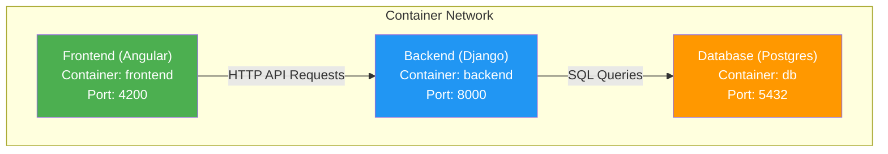

# PoopyFeed Deployment Guide

This guide explains how to deploy both the front-end (Angular) and
back-end (Django) together for local development.

## Architecture Overview



### Service Communication

- **Frontend → Backend**: HTTP requests proxied through Angular dev server
    - Frontend makes requests to `/api/*`
    - Angular proxy forwards to `http://backend:8000/api/*`
    - CORS configured to allow `http://localhost:4200`

- **Backend → Database**: PostgreSQL connection
    - Django connects via `DATABASE_HOST=db`

## Quick Start

### Prerequisites

- **Podman** (recommended) or Docker installed
- **Make** installed
- **Git** with submodules initialized

### 1. Initial Setup

```bash
# Clone repository with submodules
git clone <repo-url>
cd poopyfeed
git submodule update --init --recursive

# Install pre-commit hooks (optional but recommended)
make pre-commit-setup
```

### 2. Start Services

```bash
# Build images and start all services
make run
```

This will:

1. Build the Django backend image
2. Build the Angular frontend image
3. Start PostgreSQL database
4. Start Django backend (<http://localhost:8000>)
5. Start Angular frontend (<http://localhost:4200>)

**Access Points:**

- **Frontend**: <http://localhost:4200>
- **Backend API**: <http://localhost:8000/api/v1/>
- **Django Admin**: <http://localhost:8000/admin/>

### 3. Run Migrations

```bash
# Run Django database migrations
make migrate
```

### 4. Create Admin User

```bash
# Create Django superuser for admin access
make createsuperuser
```

## Development Commands

### General Commands

```bash
make run              # Start all services
make stop             # Stop all services
make restart          # Restart all services
make logs             # View all service logs
make logs-backend     # View backend logs only
make logs-frontend    # View frontend logs only
make clean            # Stop services and remove volumes
```

### Backend Commands

```bash
make migrate          # Run Django migrations
make test-backend     # Run Django tests with coverage
make shell-backend    # Open Django shell
make createsuperuser  # Create Django admin user
```

### Frontend Commands

```bash
make test-frontend    # Run Angular tests (Vitest)
make build-frontend   # Build production frontend
make shell-frontend   # Open frontend container shell
```

## Configuration Details

### Root Compose File (`podman-compose.yaml`)

The root compose file orchestrates all three services:

- **db**: PostgreSQL 14 database
- **backend**: Django 6.0 application
- **frontend**: Angular 21 application

All services are connected via a shared `poopyfeed-network` bridge network.

### Angular Proxy Configuration (`front-end/poopyfeed/proxy.conf.json`)

The Angular dev server proxies API requests to the backend:

```json
{
    "/api": {
        "target": "http://backend:8000",
        "secure": false,
        "changeOrigin": true,
        "logLevel": "debug"
    }
}
```

**How it works:**

1. Frontend makes request to `/api/v1/children/`
2. Angular dev server intercepts the request
3. Forwards to `http://backend:8000/api/v1/children/`
4. Returns response to frontend

### CORS Configuration (Backend)

Django CORS settings in `back-end/django_project/settings.py`:

```python
CORS_ALLOWED_ORIGINS = [
    "http://localhost:4200",  # Angular dev server
    "http://127.0.0.1:4200",
]
CORS_ALLOW_CREDENTIALS = True
```

This allows the Angular app to make authenticated requests to the Django API.

### Environment Variables

#### Backend Environment Variables

Set in `podman-compose.yaml` under the `backend` service:

```yaml
environment:
    - "DJANGO_SECRET_KEY=change-this-key"
    - "DJANGO_DEBUG=True"
    - "DJANGO_ALLOWED_HOSTS=localhost,127.0.0.1,backend"
    - "DATABASE_HOST=db"
    - "DATABASE_NAME=postgres"
    - "DATABASE_USER=postgres"
```

#### Frontend Environment Variables

Set in `podman-compose.yaml` under the `frontend` service:

```yaml
environment:
    - "NODE_ENV=development"
    - "API_URL=http://backend:8000"
```

## Troubleshooting

### Services won't start

```bash
# Check service status
podman compose ps

# View logs for errors
make logs

# Rebuild images
podman compose build --no-cache
make run
```

### Frontend can't connect to backend

1. **Check CORS settings** in `back-end/django_project/settings.py`
2. **Verify proxy config** in `front-end/poopyfeed/proxy.conf.json`
3. **Check network connectivity**:

    ```bash
    # Enter frontend container
    make shell-frontend

    # Try to reach backend
    wget -O- http://backend:8000/api/v1/
    ```

### Database connection errors

```bash
# Check database is running
podman compose ps db

# View database logs
podman compose logs db

# Restart database
podman compose restart db
```

### Port conflicts

If ports 4200 or 8000 are already in use:

1. **Find process using the port**:

    ```bash
    lsof -i :4200
    lsof -i :8000
    ```

2. **Kill the process** or change ports in `podman-compose.yaml`:

    ```yaml
    ports:
        - "4201:4200" # Map to different host port
    ```

### Volume/permission issues

```bash
# Clean up volumes and restart
make clean
make run
```

## Production Deployment

For production deployment, see:

- **Backend**: `back-end/README.md` (Render deployment instructions)
- **Frontend**: `front-end/Containerfile` (multi-stage build with nginx)

### Production Build

```bash
# Build production frontend image
cd front-end
make image-build-prod

# Production image uses nginx and serves from dist/
```

### Production Environment Variables

For production, set:

**Backend**:

- `DJANGO_DEBUG=False`
- `DJANGO_SECRET_KEY` (strong random key)
- `DJANGO_ALLOWED_HOSTS` (your domain)
- `DATABASE_URL` (PostgreSQL connection string)
- `CORS_ALLOWED_ORIGINS` (your frontend domain)

**Frontend**:

- Configure nginx to proxy `/api/` to your backend domain
- Set environment-specific API URLs

## Development Workflow

### Typical Workflow

1. **Start services**: `make run`
2. **Check logs**: `make logs` (in another terminal)
3. **Make changes**: Edit code in `front-end/` or `back-end/`
4. **Changes auto-reload**: Both containers have volume mounts for hot reload
5. **Run tests**: `make test-frontend` or `make test-backend`
6. **Commit changes**: Pre-commit hooks enforce code quality
7. **Stop services**: `make stop`

### Hot Reload

Both frontend and backend support hot reload:

- **Frontend**: Angular dev server watches files in `front-end/poopyfeed/`
- **Backend**: Django runserver watches files in `back-end/`

No need to rebuild containers after code changes!

### Running Services Individually

If you want to run just one service:

```bash
# Backend only (with database)
cd back-end
make run

# Frontend only (assumes backend is running separately)
cd front-end
make run
```

## API Integration Example

### Frontend Service Example

```typescript
// src/app/services/child.service.ts
import { Injectable, inject } from "@angular/core";
import { HttpClient } from "@angular/common/http";

@Injectable({
    providedIn: "root",
})
export class ChildService {
    private http = inject(HttpClient);

    // No need to specify full URL - proxy handles it
    getChildren() {
        return this.http.get("/api/v1/children/");
    }
}
```

The proxy automatically forwards `/api/*` requests to the backend.

## Additional Resources

- **Backend CLAUDE.md**: `back-end/CLAUDE.md` - Django architecture and
  patterns
- **Frontend CLAUDE.md**: `front-end/poopyfeed/.claude/CLAUDE.md` - Angular
  best practices
- **API Documentation**: `front-end/docs/API.md` - Full REST API reference
- **Root Makefile**: `Makefile` - All available commands

## Support

For issues or questions:

1. Check logs: `make logs`
2. Verify services are running: `podman compose ps`
3. Review this guide's Troubleshooting section
4. Check CLAUDE.md files for architecture details
