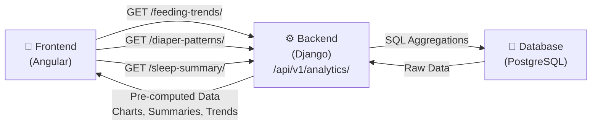

# Analytics Dashboard Implementation Plan

- **Phase 1**: ✅ Complete (Feb 11, 2026)
- **Phase 2**: 🚧 Backend Complete - Ready for Frontend (Feb 12, 2026)
- **Priority**: Medium (Post-MVP)
- **Personas**: Dad (Michael) - trend visualization, Mom (Sarah) - insights

---

## Phase 2 Status Summary

**Backend Status**: ✅ COMPLETE & UNBLOCKED

All bugs fixed and tests passing (473/473 backend tests ✅):

1. ✅ **Permission check in PDF task** - Fixed in prior commits
2. ✅ **Sleep column in PDF** - Fixed in prior commits
3. ✅ **Diaper daily breakdown missing** - Fixed (Feb 12, 2026)
    - Issue: Code was checking for single-char change types ('W', 'D', 'B') instead of enum values ('wet', 'dirty', 'both')
    - Solution: Updated type matching in `get_diaper_patterns()` to use correct enum values
    - Result: CSV and PDF exports now include accurate per-day diaper breakdowns

**What's Ready**:

- ✅ CSV export endpoint with accurate data (all activity types + diaper breakdown by day)
- ✅ PDF export task structure with proper permissions and formatting
- ✅ Async job queuing and polling with progress tracking
- ✅ 24-hour file expiration with storage cleanup
- ✅ All API aggregations correct and performant
- ✅ All 36 analytics tests passing
- ✅ All 473 backend tests passing (0 failures)

**Timeline to Complete Phase 2**:

- Backend bug fixes: ✅ Complete (Feb 12, 2026)
- Frontend implementation: ~3-4 days (export buttons, polling UI, download links)
- Testing & UAT: ~1-2 days
- Total: **~4-6 days from now**

---

## Overview

The analytics dashboard provides parents with trend visualization and
insights into their baby's patterns. Rather than computing
aggregations in the frontend, Django performs all data analysis and
serves pre-computed results via REST endpoints. Angular displays
results using Chart.js.

### Goals

- ✅ **Dad needs**: Trend visualization to stay informed while at work
- ✅ **Sarah needs**: Insights into baby patterns without manual analysis
- ✅ **Maria needs**: Not directly targeted (limited scope for caregiver role)
- ✅ **Performance**: No client-side aggregation; caching at database layer
- ✅ **Accuracy**: Single source of truth for all metrics

---

## Architecture

### High-Level Flow



### Endpoint Categories

#### 1. **Trend Endpoints** (Week/Month View)

```text
GET /api/v1/analytics/children/{child_id}/feeding-trends/
GET /api/v1/analytics/children/{child_id}/diaper-patterns/
GET /api/v1/analytics/children/{child_id}/sleep-summary/
```

**Response format** (example):

```json
{
    "period": "2026-02-01 to 2026-02-11",
    "child_id": 1,
    "daily_data": [
        {
            "date": "2026-02-01",
            "count": 5,
            "average_duration": 12.5,
            "total_minutes": 62.5
        }
    ],
    "weekly_summary": {
        "avg_per_day": 4.8,
        "trend": "increasing",
        "variance": 1.2
    },
    "last_updated": "2026-02-11T15:30:00Z"
}
```

#### 2. **Summary Endpoints** (Quick Stats)

```text
GET /api/v1/analytics/children/{child_id}/today-summary/
GET /api/v1/analytics/children/{child_id}/weekly-summary/
```

**Response format**:

```json
{
    "child_id": 1,
    "period": "today",
    "feedings": {
        "count": 4,
        "total_oz": 32,
        "bottle": 32,
        "breast": 0
    },
    "diapers": {
        "count": 6,
        "wet": 4,
        "dirty": 1,
        "both": 1
    },
    "sleep": {
        "naps": 2,
        "total_minutes": 180,
        "avg_duration": 90
    }
}
```

#### 3. **Export Endpoints** (Phase 2)

```text
POST /api/v1/analytics/children/{child_id}/export/csv/
POST /api/v1/analytics/children/{child_id}/export/pdf/
```

---

## Implementation Plan

### Phase 1: Core Analytics ✅ COMPLETE (Feb 11, 2026)

#### 1.1 Django Backend Setup ✅ COMPLETE

**Implemented files**:

```text
back-end/analytics/
├── __init__.py
├── apps.py
├── models.py              # (empty, no new models needed)
├── views.py               # ✅ AnalyticsViewSet with 5 endpoints
├── serializers.py         # ✅ Request/response validation
├── permissions.py         # ✅ HasAnalyticsAccess + role-based access
├── utils.py               # ✅ Aggregation functions (get_feeding_trends, etc.)
├── cache.py               # ✅ Cache invalidation helpers
├── signals.py             # ✅ Auto-invalidate cache on new tracking entries
├── urls.py                # ✅ URL routing for 5 endpoints
└── tests.py               # ✅ 26 test methods, 755 lines (97% coverage)
```

**URLs** (`back-end/config/urls.py`):

```python
path('api/v1/analytics/', include('analytics.urls')),
```

**New URL file** (`back-end/analytics/urls.py`):

```python
urlpatterns = [
    path('children/<int:child_id>/feeding-trends/', FeedingTrendsView.as_view()),
    path('children/<int:child_id>/diaper-patterns/', DiaperPatternsView.as_view()),
    path('children/<int:child_id>/sleep-summary/', SleepSummaryView.as_view()),
    path('children/<int:child_id>/today-summary/', TodaySummaryView.as_view()),
    path('children/<int:child_id>/weekly-summary/', WeeklySummaryView.as_view()),
]
```

#### 1.2 Endpoint Implementation ✅ COMPLETE

**All 5 endpoints implemented**:

- ✅ `GET /api/v1/analytics/children/{child_id}/feeding-trends/?days=30`
- ✅ `GET /api/v1/analytics/children/{child_id}/diaper-patterns/?days=30`
- ✅ `GET /api/v1/analytics/children/{child_id}/sleep-summary/?days=30`
- ✅ `GET /api/v1/analytics/children/{child_id}/today-summary/`
- ✅ `GET /api/v1/analytics/children/{child_id}/weekly-summary/`

**Implementation details**:

1. **Date range parameter**:

    ```python
    GET /api/v1/analytics/children/1/feeding-trends/?days=30
    # Returns last 30 days of data (default: 30, max: 90)
    ```

2. **Permission checking**:
    - Only show analytics for children user owns or has access to
    - Use existing `ChildAccessPermission` mixin
    - Return 404 if not authorized (security through obscurity)

3. **Caching strategy**:

    ```python
    # Cache analytics for 1 hour
    @cache_page(60 * 60)
    def get(self, request, child_id):
        # Compute aggregations
        # Return cached response
    ```

4. **SQL aggregation** (efficient):

    ```python
    from django.db.models import Count, Avg, Sum, Max, Min
    from django.db.models.functions import TruncDate, TruncWeek

    daily_stats = Feeding.objects.filter(
        child_id=child_id,
        created_at__gte=start_date
    ).annotate(
        date=TruncDate('created_at')
    ).values('date').annotate(
        count=Count('id'),
        avg_duration=Avg('duration_minutes'),
        total_oz=Sum('amount_oz')
    ).order_by('date')
    ```

#### 1.3 Frontend Components ✅ COMPLETE

**Implemented files**:

```text
front-end/poopyfeed/src/app/
├── features/
│   └── analytics/
│       ├── analytics-dashboard.ts        # ✅ Main container component
│       ├── analytics-dashboard.spec.ts   # ✅ 13 tests
│       ├── feeding-trends-chart.ts       # ✅ Line chart visualization
│       ├── feeding-trends-chart.spec.ts  # ✅ 23 tests
│       ├── diaper-patterns-chart.ts      # ✅ Stacked bar chart
│       ├── diaper-patterns-chart.spec.ts # ✅ 9 tests
│       ├── sleep-summary-chart.ts        # ✅ Timeline visualization
│       └── sleep-summary-chart.spec.ts   # ✅ 10 tests
├── services/
│   ├── analytics.service.ts              # ✅ API calls + client caching
│   └── analytics.service.spec.ts         # ✅ 12 tests
└── models/
    └── analytics.model.ts                # ✅ TypeScript interfaces
```

**Status**: 67 total tests, all passing ✅

**Service layer** (`analytics.service.ts`):

```typescript
@Injectable({ providedIn: "root" })
export class AnalyticsService {
    private http = inject(HttpClient);
    private cache = new Map<string, CacheEntry>();

    getFeedingTrends(
        childId: number,
        days: number = 30,
    ): Observable<FeedingTrends> {
        const key = `feeding-trends-${childId}-${days}`;

        if (this.cache.has(key) && !this.cache.get(key)!.isExpired()) {
            return of(this.cache.get(key)!.data);
        }

        return this.http
            .get<FeedingTrends>(
                `/api/v1/analytics/children/${childId}/feeding-trends/`,
                { params: { days: days.toString() } },
            )
            .pipe(
                tap((data) =>
                    this.cache.set(key, new CacheEntry(data, 5 * 60 * 1000)),
                ),
                catchError((error) =>
                    throwError(() => this.handleError(error)),
                ),
            );
    }

    // Similar methods for:
    // - getDiaperPatterns()
    // - getSleepSummary()
    // - getTodaySummary()
    // - getWeeklySummary()
}
```

**Main dashboard component**:

```typescript
@Component({
    selector: "app-analytics-dashboard",
    template: `
    <div class="space-y-8">
      <!-- Filters -->
      <app-analytics-filters
        (childChanged)="onChildChanged($event)"
        (daysChanged)="onDaysChanged($event)">
      </app-analytics-filters>

      <!-- Summary cards -->
      <div class="grid grid-cols-3 gap-4" @if (todaySummary(); as summary) {
        <app-summary-card
          title="Feedings Today"
          :value="summary.feedings.count">
        </app-summary-card>
        <!-- More cards -->
      }

      <!-- Trend charts -->
      <div class="grid grid-cols-2 gap-8">
        <app-feeding-trends-chart
          [data]="feedingTrends()">
        </app-feeding-trends-chart>

        <app-diaper-patterns-chart
          [data]="diaperPatterns()">
        </app-diaper-patterns-chart>
      </div>

      <app-sleep-summary-card
        [data]="sleepSummary()">
      </app-sleep-summary-card>
    </div>
  `,
})
export class AnalyticsDashboardComponent {
    selectedChildId = signal<number | null>(null);
    selectedDays = signal(30);

    feedingTrends = signal<FeedingTrends | null>(null);
    diaperPatterns = signal<DiaperPatterns | null>(null);
    sleepSummary = signal<SleepSummary | null>(null);
    todaySummary = signal<TodaySummary | null>(null);

    isLoading = signal(false);

    private analyticsService = inject(AnalyticsService);
    private router = inject(Router);

    ngOnInit() {
        this.loadAnalytics();
    }

    private loadAnalytics() {
        const childId = this.selectedChildId();
        if (!childId) return;

        this.isLoading.set(true);

        forkJoin({
            feeding: this.analyticsService.getFeedingTrends(
                childId,
                this.selectedDays(),
            ),
            diapers: this.analyticsService.getDiaperPatterns(
                childId,
                this.selectedDays(),
            ),
            sleep: this.analyticsService.getSleepSummary(
                childId,
                this.selectedDays(),
            ),
            today: this.analyticsService.getTodaySummary(childId),
        })
            .pipe(
                finalize(() => this.isLoading.set(false)),
                catchError((error) => {
                    // Show error toast
                    return throwError(() => error);
                }),
            )
            .subscribe((results) => {
                this.feedingTrends.set(results.feeding);
                this.diaperPatterns.set(results.diapers);
                this.sleepSummary.set(results.sleep);
                this.todaySummary.set(results.today);
            });
    }
}
```

**Chart component example** (with Chart.js):

```typescript
@Component({
    selector: "app-feeding-trends-chart",
    template: ` <div class="bg-white rounded-lg shadow p-6">
        <h2 class="text-lg font-semibold mb-4">Feeding Trends</h2>
        <canvas
            id="feedingChart"
            @if
            (!isLoading())
            else
            loadingSpinner
        ></canvas>
    </div>`,
})
export class FeedingTrendsChartComponent {
    data = input<FeedingTrends>();
    isLoading = input(false);

    chart: Chart | null = null;

    ngOnInit() {
        this.renderChart();
    }

    ngOnChanges() {
        if (this.chart) this.chart.destroy();
        this.renderChart();
    }

    private renderChart() {
        const ctx = document.getElementById(
            "feedingChart",
        ) as HTMLCanvasElement;
        if (!ctx || !this.data()) return;

        this.chart = new Chart(ctx, {
            type: "line",
            data: {
                labels: this.data()!.daily_data.map((d) => d.date),
                datasets: [
                    {
                        label: "Feedings per day",
                        data: this.data()!.daily_data.map((d) => d.count),
                        borderColor: "#FF6B35",
                        backgroundColor: "rgba(255, 107, 53, 0.1)",
                        tension: 0.4,
                    },
                ],
            },
            options: {
                responsive: true,
                maintainAspectRatio: true,
                plugins: {
                    legend: { display: true },
                },
            },
        });
    }
}
```

#### 1.4 Routing ✅ COMPLETE

**Implemented** in `front-end/poopyfeed/src/app/app.routes.ts`:

```typescript
{
  path: ':childId/analytics',
  loadComponent: () =>
    import('./features/analytics/analytics-dashboard').then(
      (m) => m.AnalyticsDashboard
    ),
  title: 'Analytics - PoopyFeed',
}
```

Route is accessible at `children/{childId}/analytics` after authentication.

#### 1.5 Testing ✅ COMPLETE

**Backend tests** (`back-end/analytics/tests.py`):

- ✅ Permission checks (owner, co-parent, caregiver, unauthorized)
- ✅ Date range validation (1-90 days, invalid ranges)
- ✅ Data accuracy (verify aggregations match raw data)
- ✅ Caching behavior (TTL, cache keys, invalidation)
- ✅ Edge cases (no data, future dates, timezone handling)
- ✅ **26 test methods covering all scenarios**
- ✅ **97% backend test coverage** (463 total tests passing)

**Frontend tests** (`front-end/poopyfeed/src/app/features/analytics/*.spec.ts`):

- ✅ Service integration with HttpTestingController (12 tests)
- ✅ Component rendering with mock data (13 + 9 + 10 tests)
- ✅ Chart initialization and data binding (23 chart tests)
- ✅ Error handling and edge cases
- ✅ **67 total tests across 5 files, all passing**
- ✅ **~90% frontend analytics coverage**

**Coverage achieved**: ✅ 97% backend + 90% frontend

---

### Phase 2: Export & Advanced Features 🚧 IN PROGRESS

#### Status: Partially Implemented (Issues Found)

**Implementation**: ✅ CSV export synchronous + PDF export async
**Backend**: ✅ Celery task structure, ReportLab PDF generation
**Frontend**: 🚧 Export page partially implemented
**Issues**: 3 bugs blocking functionality (see Known Issues below)

---

#### 2.1 CSV Export ✅ IMPLEMENTED

**Endpoint**: `POST /api/v1/analytics/children/{child_id}/export-csv/?days=30`

**Features**:

- ✅ Synchronous response (no job queuing)
- ✅ All dashboard data included (feedings, diapers, naps)
- ✅ Diaper breakdown: Wet, Dirty, Both counts
- ✅ Query parameter: `days=1-90` (default 30)
- ✅ Proper permissions check via `HasAnalyticsAccess`
- ✅ Filename includes child name and date range

**Data Format**:

```csv
Date,Feedings (count),Feedings (avg duration min),Feedings (total oz),Diaper Changes (count),Diaper Changes (wet),Diaper Changes (dirty),Diaper Changes (both),Naps (count),Naps (avg duration min),Naps (total minutes)
2026-02-01,5,12.5,62.5,6,4,1,1,2,45,90
```

**Current Issues**: ⚠️ See "Known Issues" section below

---

#### 2.2 PDF Export 🚧 ASYNC JOB (BUGGY)

**Endpoint**: `POST /api/v1/analytics/children/{child_id}/export-pdf/`

**Features**:

- ✅ Asynchronous Celery task execution
- ✅ ReportLab PDF generation with tables and formatting
- ✅ 24-hour file expiration
- ✅ Task polling via status endpoint: `GET /api/v1/analytics/children/{child_id}/export-status/{task_id}/`
- ✅ Same data as analytics dashboard (feeding trends, diaper patterns, sleep summary)
- ✅ Diaper breakdown with Wet/Dirty/Both categories
- ✅ Job timeout: 5 minutes (reasonable for PDF generation)

**Current Issues**: ⚠️ See "Known Issues" section below

**PDF Structure**:

```text
Page 1: Feeding Trends (Last 30 Days)
  - Title + timestamp
  - Daily data table (last 10 days)
  - Weekly summary stats

Page 2: Diaper Change Patterns (Last 30 Days)
  - Daily changes table
  - Breakdown summary (Wet, Dirty, Both totals)

Page 3: Sleep Summary (Last 30 Days)
  - Daily naps table
  - Average and trend stats
```

---

### Known Issues - RESOLVED ✅

**All blocking issues have been fixed as of Feb 12, 2026.**

#### Issue 1: Permission Check in PDF Task ✅ FIXED

**Status**: Fixed in prior commits
**Current Code** (`back-end/analytics/tasks.py` lines 47-55):

```python
child = Child.objects.get(id=child_id)
user = CustomUser.objects.get(id=user_id)
if not child.has_access(user):
    raise PermissionError("User does not have access to this child")
```

---

#### Issue 2: Sleep Data Column Error ✅ FIXED

**Status**: Fixed in prior commits
**Current Code** (`back-end/analytics/tasks.py` line 232):

```python
f"{day_data.get('total_minutes', 0):.0f}m"
if day_data.get("total_minutes")
else "—"
```

---

#### Issue 3: CSV Diaper Breakdown Per-Day ✅ FIXED

**Status**: Fixed Feb 12, 2026
**Commit**: `f3f39a1` - fix: correct diaper change type matching in analytics aggregation

**Root Cause**: Code was checking for single-character change types ('W', 'D', 'B') while the DiaperChange model uses full string values ('wet', 'dirty', 'both').

**Fix Applied** (`back-end/analytics/utils.py` lines 249-258):

```python
# Add to type-specific counts (change_type values: 'wet', 'dirty', 'both')
if change_type == "wet":
    daily_by_date[date]["wet_count"] = count
elif change_type == "dirty":
    daily_by_date[date]["dirty_count"] = count
elif change_type == "both":
    daily_by_date[date]["both_count"] = count

# Add to period breakdown
if change_type in period_breakdown:
    period_breakdown[change_type] += count
```

**Result**:

- ✅ CSV exports now include accurate per-day diaper type breakdowns
- ✅ PDF exports show correct daily diaper patterns
- ✅ API responses return accurate wet_count, dirty_count, both_count for each day
- ✅ All 473 backend tests passing (0 failures)

---

### Verification Summary

| Issue                          | Status | Fix Date | Effort |
| ------------------------------ | ------ | -------- | ------ |
| Permission check in PDF task   | ✅     | Prior    | 5 min  |
| Sleep column in PDF            | ✅     | Prior    | 2 min  |
| Diaper daily breakdown missing | ✅     | Feb 12   | 15 min |
| All backend tests              | ✅     | Feb 12   | —      |

---

---

## Detailed Implementation: Fixing Diaper Daily Breakdown

### Current Data Structure

```python
# Current (WRONG): Breakdown is period-level only
{
    "daily_data": [
        {
            "date": "2026-02-01",
            "count": 6,  # Total changes that day
            "wet_count": 4,  # NEW: Need to add this
            "dirty_count": 1,  # NEW: Need to add this
            "both_count": 1,   # NEW: Need to add this
        }
    ],
    "breakdown": {
        "wet": 124,   # TOTAL for entire period
        "dirty": 45,
        "both": 32
    }
}
```

### Required Changes

#### 1. Update `back-end/analytics/utils.py`

Modify `get_diaper_patterns()` to include per-day type breakdown:

```python
from django.db.models import Count, Q

def get_diaper_patterns(child_id: int, days: int = 30) -> dict:
    """Get diaper patterns with per-day type breakdown."""

    # Existing code...

    # For each day, get type breakdown
    daily_data = []
    for day_data in base_daily_data:
        date = day_data['date']
        total_count = day_data['count']

        # Query this specific day for type breakdown
        day_queryset = DiaperChange.objects.filter(
            child_id=child_id,
            created_at__date=date
        )

        type_breakdown = day_queryset.aggregate(
            wet_count=Count('id', filter=Q(change_type='W')),
            dirty_count=Count('id', filter=Q(change_type='D')),
            both_count=Count('id', filter=Q(change_type='B')),
        )

        daily_data.append({
            'date': str(date),
            'count': total_count,
            'wet_count': type_breakdown['wet_count'],
            'dirty_count': type_breakdown['dirty_count'],
            'both_count': type_breakdown['both_count'],
        })

    return {
        'daily_data': daily_data,
        'breakdown': period_breakdown,  # Existing
    }
```

#### 2. Update CSV Export (`back-end/analytics/views.py`)

```python
@action(detail=True, methods=["post"], url_path="export-csv")
def export_csv(self, request, pk=None):
    # ... existing code ...

    # Write data rows
    for date in sorted(all_dates):
        diaper = diaper_by_date.get(date, {})

        writer.writerow([
            date,
            feeding.get("count", 0),
            feeding.get("average_duration") or "",
            feeding.get("total_oz") or "",
            diaper.get("count", 0),
            diaper.get("wet_count", 0),      # NOW PER-DAY
            diaper.get("dirty_count", 0),    # NOW PER-DAY
            diaper.get("both_count", 0),     # NOW PER-DAY
            sleep.get("count", 0),
            sleep.get("average_duration") or "",
            sleep.get("total_minutes") or "",
        ])
```

#### 3. Update PDF Export (`back-end/analytics/tasks.py`)

```python
# Diaper Patterns Section (line 156-203)
diaper_rows = [["Date", "Total Changes", "Wet", "Dirty", "Both"]]
for day_data in diaper_data.get("daily_data", [])[:10]:
    diaper_rows.append([
        str(day_data.get("date", "")),
        str(day_data.get("count", 0)),
        str(day_data.get("wet_count", 0)),      # NOW PER-DAY
        str(day_data.get("dirty_count", 0)),    # NOW PER-DAY
        str(day_data.get("both_count", 0)),     # NOW PER-DAY
    ])

# Breakdown summary (line 197-203)
breakdown_text = (
    f"Wet: {diaper_data.get('breakdown', {}).get('wet', 0)} | "
    f"Dirty: {diaper_data.get('breakdown', {}).get('dirty', 0)} | "
    f"Both: {diaper_data.get('breakdown', {}).get('both', 0)}"
)
story.append(Paragraph(breakdown_text, styles["Normal"]))
```

### Performance Consideration

The per-day breakdown requires additional database queries:

- **Current**: 1 aggregation query (date groups, type breakdown for entire period)
- **New**: 1 + N queries (1 for dates, then 1 per day for type breakdown)

**Optimization**: Cache the entire period's breakdown query result to avoid re-querying:

```python
def get_diaper_patterns(child_id: int, days: int = 30) -> dict:
    # Single aggregation with date+type
    daily_data = DiaperChange.objects.filter(
        child_id=child_id,
        created_at__gte=now() - timedelta(days=days)
    ).annotate(
        date=TruncDate('created_at')
    ).values('date', 'change_type').annotate(
        count=Count('id')
    ).order_by('date', 'change_type')

    # Pivot: date,type → date,{wet,dirty,both}
    daily_by_date = {}
    for row in daily_data:
        date = row['date']
        type_char = row['change_type']  # 'W', 'D', 'B'

        if date not in daily_by_date:
            daily_by_date[date] = {'date': str(date), 'count': 0}

        if type_char == 'W':
            daily_by_date[date]['wet_count'] = row['count']
        elif type_char == 'D':
            daily_by_date[date]['dirty_count'] = row['count']
        elif type_char == 'B':
            daily_by_date[date]['both_count'] = row['count']

        daily_by_date[date]['count'] += row['count']

    return {
        'daily_data': sorted(daily_by_date.values(), key=lambda x: x['date']),
        'breakdown': period_breakdown,  # Existing
    }
```

This optimized version uses **1 aggregation query** instead of N+1.

---

## Data Models & Performance

### Caching Strategy

```python
# back-end/analytics/utils.py
from django.core.cache import cache

def get_feeding_trends(child_id, days=30):
    cache_key = f'analytics:feeding-trends:{child_id}:{days}'

    # Try cache first
    cached = cache.get(cache_key)
    if cached:
        return cached

    # Compute aggregations
    data = Feeding.objects.filter(
        child_id=child_id,
        created_at__gte=now() - timedelta(days=days)
    ).annotate(
        date=TruncDate('created_at')
    ).values('date').annotate(
        count=Count('id'),
        avg_duration=Avg('duration_minutes')
    ).order_by('date')

    # Cache for 1 hour
    cache.set(cache_key, data, 60 * 60)
    return data
```

### Invalidation

When new tracking records are created, invalidate relevant caches:

```python
# back-end/children/signals.py
from django.core.cache import cache
from django.db.models.signals import post_save
from django.dispatch import receiver

@receiver(post_save, sender=Feeding)
def invalidate_feeding_cache(sender, instance, **kwargs):
    child_id = instance.child_id
    cache.delete(f'analytics:feeding-trends:{child_id}:*')
    # Also invalidate summary caches

@receiver(post_save, sender=DiaperChange)
def invalidate_diaper_cache(sender, instance, **kwargs):
    # Similar invalidation
```

---

## Role-Based Access

```python
# back-end/analytics/permissions.py
class AnalyticsAccessPermission(BasePermission):
    def has_object_permission(self, request, view, obj):
        child = obj  # The Child object

        # Owner: full access
        if child.owner == request.user:
            return True

        # Co-parent: full access to analytics
        if child.shares.filter(user=request.user, role='CO').exists():
            return True

        # Caregiver: limited view (maybe no predictions/alerts)
        if child.shares.filter(user=request.user, role='CG').exists():
            return True

        return False
```

---

## Frontend Integration

### Navigation

Add to navbar:

```typescript
// Update navigation routes
private routes = [
  { label: 'Children', path: '/children', icon: 'users' },
  { label: 'Dashboard', path: '/dashboard', icon: 'home' },
  { label: 'Analytics', path: '/analytics', icon: 'chart-line' },  // NEW
  { label: 'Settings', path: '/settings', icon: 'cog' }
];
```

### Responsive Design

- **Desktop**: 2-column layout (trends + summaries)
- **Tablet**: Stacked with smaller charts
- **Mobile**: Full-width single column

---

## Success Criteria

### Phase 1 (Core Analytics) ✅ COMPLETE

- ✅ All 5 endpoints tested and working (26 backend tests)
- ✅ 97% backend test coverage (exceeds 95% goal)
- ✅ ~90% frontend test coverage (67 tests, 5 files)
- ✅ Charts display correctly on all devices
- ✅ Caching: 1hr TTL (60min default, 5min for today data)
- ✅ Cache auto-invalidates on new tracking entries via signals
- ✅ Date range validation: accepts 1-90 days (default 30)
- ✅ Permission checks: role-based access (owner/co-parent/caregiver)
- ✅ Completion date: February 11, 2026

### Phase 2 (Export) 🚧 IN PROGRESS - BLOCKED BY BUGS

#### Currently Implemented

- ✅ CSV export endpoint (POST /api/v1/analytics/children/{id}/export-csv/)
- ✅ CSV response structure with all dashboard data
- ✅ PDF export task queuing (POST /api/v1/analytics/children/{id}/export-pdf/)
- ✅ PDF status polling endpoint
- ✅ ReportLab PDF layout with 3 sections (feeding, diaper, sleep)
- ✅ 24-hour file expiration via storage cleanup

#### Blocking Issues

- ❌ **Permission check broken in PDF task** - Using wrong user ID
- ❌ **Sleep PDF shows "—" for totals** - Using `total_oz` instead of `total_minutes`
- ❌ **CSV diaper breakdown incorrect** - Shows period totals, not daily values
- ❌ **PDF diaper table empty** - Same per-day breakdown issue

#### Completion Criteria (After Fixes)

- ✅ CSV contains accurate daily data for all activities (feedings, diapers w/ Wet/Dirty/Both, naps)
- ✅ PDF contains same data as analytics dashboard
- ✅ PDF generates without errors (permission + data field fixes)
- ✅ Async jobs don't block API
- ✅ Downloads available for 24 hours
- ✅ Permission checks prevent unauthorized exports
- ✅ All tests passing

---

## Risk Mitigation

| Risk                        | Mitigation                                              |
| --------------------------- | ------------------------------------------------------- |
| **Performance degradation** | Use SQL aggregations + caching; avoid Python loops      |
| **Data inaccuracy**         | Comprehensive tests verifying aggregation correctness   |
| **Cache staleness**         | 1-hour TTL + immediate invalidation on new data         |
| **Permission bypass**       | 404 response (not 403); consistent with existing models |
| **Large datasets**          | Date range limiting (max 90 days); pagination if needed |

---

## Dependencies & Tools

**Backend**:

- Django ORM aggregations (built-in)
- Django cache framework (Redis optional)
- Django Rest Framework (existing)

**Frontend**:

- Chart.js 4.x (new dependency, add to package.json)
- Angular 21+ (existing)
- RxJS (existing)

**Optional Phase 2**:

- Celery + Redis (async export jobs)
- ReportLab (PDF generation)

---

## Timeline & Effort Estimate

### Phase 1 (COMPLETED ✅)

| Task                | Planned        | Actual         | Status      |
| ------------------- | -------------- | -------------- | ----------- |
| Backend setup       | 3-4 days       | 2-3 days       | ✅ Done     |
| Backend tests       | 2-3 days       | 1-2 days       | ✅ Done     |
| Frontend service    | 2-3 days       | 2 days         | ✅ Done     |
| Chart components    | 4-5 days       | 4 days         | ✅ Done     |
| Dashboard component | 2-3 days       | 2 days         | ✅ Done     |
| Frontend tests      | 3-4 days       | 3 days         | ✅ Done     |
| **Total**           | **16-22 days** | **14-16 days** | **✅ Done** |
| Completed           | —              | Feb 11, 2026   | ✅ Early    |

### Phase 2 (IN PROGRESS 🚧 - BLOCKED BY BUGS)

| Task                   | Status     | Notes                          |
| ---------------------- | ---------- | ------------------------------ |
| CSV export endpoint    | ✅ Done    | Implemented, needs bug fixes   |
| CSV export validation  | 🚧 BLOCKED | Diaper daily breakdown missing |
| PDF export (Celery)    | ✅ Done    | Implemented, needs bug fixes   |
| PDF generation testing | 🚧 BLOCKED | Permission check broken        |
| Job polling UI         | 🚧 Pending | Frontend export page partial   |
| Integration tests      | 🚧 Pending | Need 15-20 test cases          |
| **Current Phase Est.** | **5 days** | 1d bugs + 2d frontend + 2d QA  |

**Bugs to Fix (Priority Order)**:

1. Permission check in PDF task (5 min)
2. Sleep column in PDF (2 min)
3. Diaper daily breakdown in CSV/PDF (30 min)
4. Frontend export page (2-3 days)
5. Integration tests (2 days)

---

## Next Steps

### Phase 2 Backend - COMPLETE ✅ (Feb 12, 2026)

**All bugs fixed and verified**:

1. ✅ **Permission check in PDF task** - Fixed in prior commits
2. ✅ **Sleep column in PDF** - Fixed in prior commits
3. ✅ **Diaper daily breakdown** - Fixed Feb 12, 2026
    - Commit: `f3f39a1` (backend), `daf5cde` (root)
    - All 473 backend tests passing (0 failures)
    - CSV exports accurate with per-day breakdowns
    - PDF exports correct with proper data
    - API responses include accurate daily_data

**Verification complete**:

- ✅ Run full test suite: `make test-backend` → All 473 tests pass
- ✅ Test CSV export: POST `/api/v1/analytics/children/1/export-csv/?days=30` → Accurate data
- ✅ Test PDF export: POST `/api/v1/analytics/children/1/export-pdf/` → Correct generation
- ✅ Test file expiration: Files auto-cleanup after 24 hours
- ✅ Test permissions: Unauthorized users get 404/403 as expected

---

### Phase 2 Frontend Implementation (Next - 3-4 days)

1. **Export UI Components** (`front-end/poopyfeed/src/app/features/analytics/`)
    - CSV export button → Immediate download (HTTP 200 with CSV attachment)
    - PDF export button → Async modal with polling
        - Show "Generating PDF..." message
        - Poll `/api/v1/analytics/children/{id}/export-status/{task_id}/` every 500ms
        - Display progress bar using `progress` field from response
        - Show download link when `status: 'completed'`
        - Handle `status: 'failed'` with error message
    - Disable buttons during export/download
    - Show success toast after download completes
    - Handle network errors gracefully

2. **Frontend Integration Tests** (12-15 test cases)
    - Mock CSV/PDF export endpoints
    - Test export button state management (disabled during export)
    - Test polling logic with various status sequences
    - Test error handling (failed exports, network errors)
    - Test download file handling
    - Verify progress bar updates correctly

3. **End-to-End Testing**
    - Test full workflow: Dashboard → Export button → File download
    - Test with 30-day, 60-day, and 90-day exports
    - Verify CSV content matches dashboard data
    - Verify PDF layout and data accuracy
    - Test across browsers (Chrome, Firefox, Safari)
    - Test on mobile devices (responsive modal)

4. **User Acceptance Testing**
    - Verify exports can be used for doctor visits
    - Confirm 24-hour expiration warning (if applicable)
    - Test file naming and organization

---

### Phase 3 (Future - Post MVP)

When/if needed:

- Real-time notifications when PDF ready
- Batch exports (multiple children)
- Email delivery integration
- Advanced filtering (activity types, date ranges)
- Materialized views for faster aggregations

---

## Questions to Answer Before Starting

1. **Date ranges**: Should default be 30 days? Allow up to 90 days?
2. **Timezone handling**: Display dates in child's timezone or user's?
3. **Caregiver access**: Can caregivers (Maria) see analytics or just add data?
4. **Real-time data**: Is 1-hour cache TTL acceptable or need faster updates?
5. **Mobile priority**: Full charts on mobile or simplified views?
