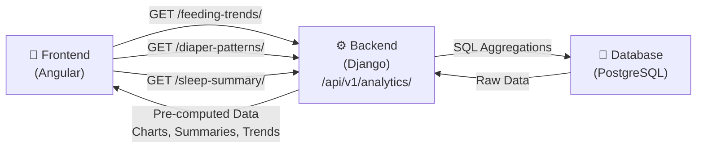

# Analytics Dashboard Implementation Plan

- **Status**: Design (Not Started)
- **Priority**: Medium (Post-MVP)
- **Personas**: Dad (Michael) - trend visualization, Mom (Sarah) - insights
- **Timeline**: 4-6 weeks (Phase 1: Core trends, Phase 2: Export)

---

## Overview

The analytics dashboard provides parents with trend visualization and
insights into their baby's patterns. Rather than computing
aggregations in the frontend, Django performs all data analysis and
serves pre-computed results via REST endpoints. Angular displays
results using Chart.js.

### Goals

- ✅ **Dad needs**: Trend visualization to stay informed while at work
- ✅ **Sarah needs**: Insights into baby patterns without manual analysis
- ✅ **Maria needs**: Not directly targeted (limited scope for caregiver role)
- ✅ **Performance**: No client-side aggregation; caching at database layer
- ✅ **Accuracy**: Single source of truth for all metrics

---

## Architecture

### High-Level Flow



### Endpoint Categories

#### 1. **Trend Endpoints** (Week/Month View)

```text
GET /api/v1/analytics/children/{child_id}/feeding-trends/
GET /api/v1/analytics/children/{child_id}/diaper-patterns/
GET /api/v1/analytics/children/{child_id}/sleep-summary/
```

**Response format** (example):

```json
{
    "period": "2026-02-01 to 2026-02-11",
    "child_id": 1,
    "daily_data": [
        {
            "date": "2026-02-01",
            "count": 5,
            "average_duration": 12.5,
            "total_minutes": 62.5
        }
    ],
    "weekly_summary": {
        "avg_per_day": 4.8,
        "trend": "increasing",
        "variance": 1.2
    },
    "last_updated": "2026-02-11T15:30:00Z"
}
```

#### 2. **Summary Endpoints** (Quick Stats)

```text
GET /api/v1/analytics/children/{child_id}/today-summary/
GET /api/v1/analytics/children/{child_id}/weekly-summary/
```

**Response format**:

```json
{
    "child_id": 1,
    "period": "today",
    "feedings": {
        "count": 4,
        "total_oz": 32,
        "bottle": 32,
        "breast": 0
    },
    "diapers": {
        "count": 6,
        "wet": 4,
        "dirty": 1,
        "both": 1
    },
    "sleep": {
        "naps": 2,
        "total_minutes": 180,
        "avg_duration": 90
    }
}
```

#### 3. **Export Endpoints** (Phase 2)

```text
POST /api/v1/analytics/children/{child_id}/export/csv/
POST /api/v1/analytics/children/{child_id}/export/pdf/
```

---

## Implementation Plan

### Phase 1: Core Analytics (Weeks 1-3)

#### 1.1 Django Backend Setup

**New files to create**:

```text
back-end/analytics/
├── __init__.py
├── models.py              # Cache models if needed
├── views.py               # Endpoint implementations
├── serializers.py         # Response formatting
├── permissions.py         # Role-based access
├── utils.py               # Aggregation helpers
└── tests.py               # Comprehensive tests (aim for 95%+ coverage)
```

**URLs** (`back-end/config/urls.py`):

```python
path('api/v1/analytics/', include('analytics.urls')),
```

**New URL file** (`back-end/analytics/urls.py`):

```python
urlpatterns = [
    path('children/<int:child_id>/feeding-trends/', FeedingTrendsView.as_view()),
    path('children/<int:child_id>/diaper-patterns/', DiaperPatternsView.as_view()),
    path('children/<int:child_id>/sleep-summary/', SleepSummaryView.as_view()),
    path('children/<int:child_id>/today-summary/', TodaySummaryView.as_view()),
    path('children/<int:child_id>/weekly-summary/', WeeklySummaryView.as_view()),
]
```

#### 1.2 Endpoint Implementation

**Key considerations**:

1. **Date range parameter**:

    ```python
    GET /api/v1/analytics/children/1/feeding-trends/?days=30
    # Returns last 30 days of data (default: 30, max: 90)
    ```

2. **Permission checking**:
    - Only show analytics for children user owns or has access to
    - Use existing `ChildAccessPermission` mixin
    - Return 404 if not authorized (security through obscurity)

3. **Caching strategy**:

    ```python
    # Cache analytics for 1 hour
    @cache_page(60 * 60)
    def get(self, request, child_id):
        # Compute aggregations
        # Return cached response
    ```

4. **SQL aggregation** (efficient):

    ```python
    from django.db.models import Count, Avg, Sum, Max, Min
    from django.db.models.functions import TruncDate, TruncWeek

    daily_stats = Feeding.objects.filter(
        child_id=child_id,
        created_at__gte=start_date
    ).annotate(
        date=TruncDate('created_at')
    ).values('date').annotate(
        count=Count('id'),
        avg_duration=Avg('duration_minutes'),
        total_oz=Sum('amount_oz')
    ).order_by('date')
    ```

#### 1.3 Frontend Components

**New files**:

```text
front-end/poopyfeed/src/app/
├── features/
│   └── analytics/
│       ├── analytics-dashboard.ts        # Main container
│       ├── feeding-trends-chart.ts       # Reusable chart component
│       ├── diaper-patterns-chart.ts
│       ├── sleep-summary-card.ts
│       └── analytics-filters.ts          # Date range, child selector
├── services/
│   └── analytics.service.ts              # API calls + caching
└── models/
    └── analytics.model.ts                # TypeScript interfaces
```

**Service layer** (`analytics.service.ts`):

```typescript
@Injectable({ providedIn: "root" })
export class AnalyticsService {
    private http = inject(HttpClient);
    private cache = new Map<string, CacheEntry>();

    getFeedingTrends(
        childId: number,
        days: number = 30,
    ): Observable<FeedingTrends> {
        const key = `feeding-trends-${childId}-${days}`;

        if (this.cache.has(key) && !this.cache.get(key)!.isExpired()) {
            return of(this.cache.get(key)!.data);
        }

        return this.http
            .get<FeedingTrends>(
                `/api/v1/analytics/children/${childId}/feeding-trends/`,
                { params: { days: days.toString() } },
            )
            .pipe(
                tap((data) =>
                    this.cache.set(key, new CacheEntry(data, 5 * 60 * 1000)),
                ),
                catchError((error) =>
                    throwError(() => this.handleError(error)),
                ),
            );
    }

    // Similar methods for:
    // - getDiaperPatterns()
    // - getSleepSummary()
    // - getTodaySummary()
    // - getWeeklySummary()
}
```

**Main dashboard component**:

```typescript
@Component({
    selector: "app-analytics-dashboard",
    template: `
    <div class="space-y-8">
      <!-- Filters -->
      <app-analytics-filters
        (childChanged)="onChildChanged($event)"
        (daysChanged)="onDaysChanged($event)">
      </app-analytics-filters>

      <!-- Summary cards -->
      <div class="grid grid-cols-3 gap-4" @if (todaySummary(); as summary) {
        <app-summary-card
          title="Feedings Today"
          :value="summary.feedings.count">
        </app-summary-card>
        <!-- More cards -->
      }

      <!-- Trend charts -->
      <div class="grid grid-cols-2 gap-8">
        <app-feeding-trends-chart
          [data]="feedingTrends()">
        </app-feeding-trends-chart>

        <app-diaper-patterns-chart
          [data]="diaperPatterns()">
        </app-diaper-patterns-chart>
      </div>

      <app-sleep-summary-card
        [data]="sleepSummary()">
      </app-sleep-summary-card>
    </div>
  `,
})
export class AnalyticsDashboardComponent {
    selectedChildId = signal<number | null>(null);
    selectedDays = signal(30);

    feedingTrends = signal<FeedingTrends | null>(null);
    diaperPatterns = signal<DiaperPatterns | null>(null);
    sleepSummary = signal<SleepSummary | null>(null);
    todaySummary = signal<TodaySummary | null>(null);

    isLoading = signal(false);

    private analyticsService = inject(AnalyticsService);
    private router = inject(Router);

    ngOnInit() {
        this.loadAnalytics();
    }

    private loadAnalytics() {
        const childId = this.selectedChildId();
        if (!childId) return;

        this.isLoading.set(true);

        forkJoin({
            feeding: this.analyticsService.getFeedingTrends(
                childId,
                this.selectedDays(),
            ),
            diapers: this.analyticsService.getDiaperPatterns(
                childId,
                this.selectedDays(),
            ),
            sleep: this.analyticsService.getSleepSummary(
                childId,
                this.selectedDays(),
            ),
            today: this.analyticsService.getTodaySummary(childId),
        })
            .pipe(
                finalize(() => this.isLoading.set(false)),
                catchError((error) => {
                    // Show error toast
                    return throwError(() => error);
                }),
            )
            .subscribe((results) => {
                this.feedingTrends.set(results.feeding);
                this.diaperPatterns.set(results.diapers);
                this.sleepSummary.set(results.sleep);
                this.todaySummary.set(results.today);
            });
    }
}
```

**Chart component example** (with Chart.js):

```typescript
@Component({
    selector: "app-feeding-trends-chart",
    template: ` <div class="bg-white rounded-lg shadow p-6">
        <h2 class="text-lg font-semibold mb-4">Feeding Trends</h2>
        <canvas
            id="feedingChart"
            @if
            (!isLoading())
            else
            loadingSpinner
        ></canvas>
    </div>`,
})
export class FeedingTrendsChartComponent {
    data = input<FeedingTrends>();
    isLoading = input(false);

    chart: Chart | null = null;

    ngOnInit() {
        this.renderChart();
    }

    ngOnChanges() {
        if (this.chart) this.chart.destroy();
        this.renderChart();
    }

    private renderChart() {
        const ctx = document.getElementById(
            "feedingChart",
        ) as HTMLCanvasElement;
        if (!ctx || !this.data()) return;

        this.chart = new Chart(ctx, {
            type: "line",
            data: {
                labels: this.data()!.daily_data.map((d) => d.date),
                datasets: [
                    {
                        label: "Feedings per day",
                        data: this.data()!.daily_data.map((d) => d.count),
                        borderColor: "#FF6B35",
                        backgroundColor: "rgba(255, 107, 53, 0.1)",
                        tension: 0.4,
                    },
                ],
            },
            options: {
                responsive: true,
                maintainAspectRatio: true,
                plugins: {
                    legend: { display: true },
                },
            },
        });
    }
}
```

#### 1.4 Routing

Add to `front-end/poopyfeed/src/app/app.routes.ts`:

```typescript
{
  path: 'analytics',
  component: AnalyticsDashboardComponent,
  canActivate: [authGuard],
  data: { title: 'Analytics' }
}
```

#### 1.5 Testing

**Backend tests** (`back-end/analytics/tests.py`):

- Permission checks (owner, co-parent, caregiver, unauthorized)
- Date range validation
- Data accuracy (verify calculations match raw data)
- Caching behavior
- Edge cases (no data, future dates, etc.)

**Frontend tests** (`front-end/poopyfeed/src/app/features/analytics/*.spec.ts`):

- Service integration with HttpTestingController
- Component rendering with mock data
- Chart initialization
- Error handling

**Coverage goal**: 95%+ on both backend and frontend

---

### Phase 2: Export & Advanced Features (Weeks 4-6)

#### 2.1 CSV Export

```python
# back-end/analytics/views.py
class ExportCSVView(APIView):
    permission_classes = [IsAuthenticated, ChildAccessPermission]

    def post(self, request, child_id):
        child = get_object_or_404(Child, id=child_id)

        # Generate CSV in memory
        csv_buffer = StringIO()
        writer = csv.writer(csv_buffer)

        # Headers
        writer.writerow(['Date', 'Feedings', 'Diapers', 'Sleep (min)'])

        # Data rows
        for date in get_date_range(days=30):
            feedings = Feeding.objects.filter(child=child, created_at__date=date).count()
            diapers = DiaperChange.objects.filter(child=child, created_at__date=date).count()
            sleep = Nap.objects.filter(child=child, created_at__date=date).aggregate(Sum('duration_minutes'))
            writer.writerow([date, feedings, diapers, sleep])

        response = HttpResponse(csv_buffer.getvalue(), content_type='text/csv')
        response['Content-Disposition'] = f'attachment; filename="analytics-{child.name}-{date.today()}.csv"'
        return response
```

#### 2.2 PDF Export (Async Job)

```python
# back-end/analytics/tasks.py
from celery import shared_task
from reportlab.lib.pagesizes import letter
from reportlab.platypus import SimpleDocTemplate, Table, Paragraph, Spacer

@shared_task
def generate_pdf_report(child_id, user_id):
    child = Child.objects.get(id=child_id)
    user = User.objects.get(id=user_id)

    # Generate PDF with charts, summaries, insights
    filename = f'analytics-{child.name}-{date.today()}.pdf'
    path = f'/tmp/{filename}'

    doc = SimpleDocTemplate(path, pagesize=letter)
    story = []

    # Add content...
    doc.build(story)

    # Store file temporarily, return URL
    return {
        'filename': filename,
        'url': f'/api/v1/analytics/download/{filename}/',
        'expires': (now() + timedelta(hours=24)).isoformat()
    }

# Endpoint
class ExportPDFView(APIView):
    def post(self, request, child_id):
        task = generate_pdf_report.delay(child_id, request.user.id)
        return Response({'task_id': task.id})

class ExportStatusView(APIView):
    def get(self, request, task_id):
        task = AsyncResult(task_id)
        return Response({
            'status': task.status,
            'result': task.result if task.successful() else None
        })
```

---

## Data Models & Performance

### Caching Strategy

```python
# back-end/analytics/utils.py
from django.core.cache import cache

def get_feeding_trends(child_id, days=30):
    cache_key = f'analytics:feeding-trends:{child_id}:{days}'

    # Try cache first
    cached = cache.get(cache_key)
    if cached:
        return cached

    # Compute aggregations
    data = Feeding.objects.filter(
        child_id=child_id,
        created_at__gte=now() - timedelta(days=days)
    ).annotate(
        date=TruncDate('created_at')
    ).values('date').annotate(
        count=Count('id'),
        avg_duration=Avg('duration_minutes')
    ).order_by('date')

    # Cache for 1 hour
    cache.set(cache_key, data, 60 * 60)
    return data
```

### Invalidation

When new tracking records are created, invalidate relevant caches:

```python
# back-end/children/signals.py
from django.core.cache import cache
from django.db.models.signals import post_save
from django.dispatch import receiver

@receiver(post_save, sender=Feeding)
def invalidate_feeding_cache(sender, instance, **kwargs):
    child_id = instance.child_id
    cache.delete(f'analytics:feeding-trends:{child_id}:*')
    # Also invalidate summary caches

@receiver(post_save, sender=DiaperChange)
def invalidate_diaper_cache(sender, instance, **kwargs):
    # Similar invalidation
```

---

## Role-Based Access

```python
# back-end/analytics/permissions.py
class AnalyticsAccessPermission(BasePermission):
    def has_object_permission(self, request, view, obj):
        child = obj  # The Child object

        # Owner: full access
        if child.owner == request.user:
            return True

        # Co-parent: full access to analytics
        if child.shares.filter(user=request.user, role='CO').exists():
            return True

        # Caregiver: limited view (maybe no predictions/alerts)
        if child.shares.filter(user=request.user, role='CG').exists():
            return True

        return False
```

---

## Frontend Integration

### Navigation

Add to navbar:

```typescript
// Update navigation routes
private routes = [
  { label: 'Children', path: '/children', icon: 'users' },
  { label: 'Dashboard', path: '/dashboard', icon: 'home' },
  { label: 'Analytics', path: '/analytics', icon: 'chart-line' },  // NEW
  { label: 'Settings', path: '/settings', icon: 'cog' }
];
```

### Responsive Design

- **Desktop**: 2-column layout (trends + summaries)
- **Tablet**: Stacked with smaller charts
- **Mobile**: Full-width single column

---

## Success Criteria

### Phase 1 (Core Analytics)

- ✅ All 5 endpoints tested and working
- ✅ 95%+ backend test coverage
- ✅ 90%+ frontend test coverage
- ✅ Charts display correctly on mobile/tablet/desktop
- ✅ Performance: response time < 500ms (cached)
- ✅ Caching: data updated within 1 hour of new entry

### Phase 2 (Export)

- ✅ CSV exports contain accurate data
- ✅ PDF exports render charts and summaries
- ✅ Async jobs don't block API
- ✅ Downloads available for 24 hours

---

## Risk Mitigation

| Risk                        | Mitigation                                              |
| --------------------------- | ------------------------------------------------------- |
| **Performance degradation** | Use SQL aggregations + caching; avoid Python loops      |
| **Data inaccuracy**         | Comprehensive tests verifying aggregation correctness   |
| **Cache staleness**         | 1-hour TTL + immediate invalidation on new data         |
| **Permission bypass**       | 404 response (not 403); consistent with existing models |
| **Large datasets**          | Date range limiting (max 90 days); pagination if needed |

---

## Dependencies & Tools

**Backend**:

- Django ORM aggregations (built-in)
- Django cache framework (Redis optional)
- Django Rest Framework (existing)

**Frontend**:

- Chart.js 4.x (new dependency, add to package.json)
- Angular 21+ (existing)
- RxJS (existing)

**Optional Phase 2**:

- Celery + Redis (async export jobs)
- ReportLab (PDF generation)

---

## Timeline & Effort Estimate

| Task                                | Duration       | Owner    |
| ----------------------------------- | -------------- | -------- |
| Django endpoint setup (5 endpoints) | 3-4 days       | Backend  |
| Endpoint testing & documentation    | 2-3 days       | Backend  |
| Frontend service layer              | 2-3 days       | Frontend |
| Chart components (3 charts + cards) | 4-5 days       | Frontend |
| Dashboard container component       | 2-3 days       | Frontend |
| Frontend testing                    | 3-4 days       | Frontend |
| **Phase 1 Total**                   | **16-22 days** |          |
| Phase 2 (Export)                    | 8-10 days      | Both     |

---

## Next Steps

1. **Approval**: Review this plan with stakeholders
2. **Dependency addition**: `npm install chart.js` (frontend)
3. **Create app**: `python manage.py startapp analytics` (backend)
4. **Start Phase 1**: Begin with endpoint implementation
5. **Iterate**: Monthly demos to Dad (Michael) for feedback

---

## Questions to Answer Before Starting

1. **Date ranges**: Should default be 30 days? Allow up to 90 days?
2. **Timezone handling**: Display dates in child's timezone or user's?
3. **Caregiver access**: Can caregivers (Maria) see analytics or just add data?
4. **Real-time data**: Is 1-hour cache TTL acceptable or need faster updates?
5. **Mobile priority**: Full charts on mobile or simplified views?
